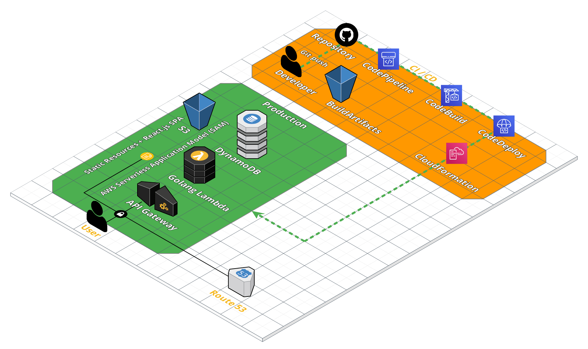
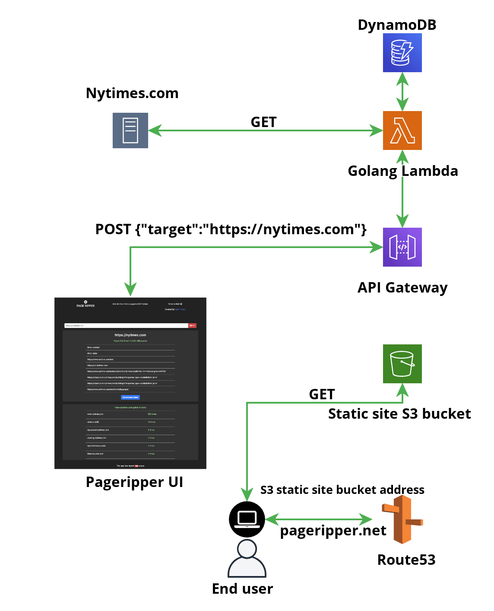
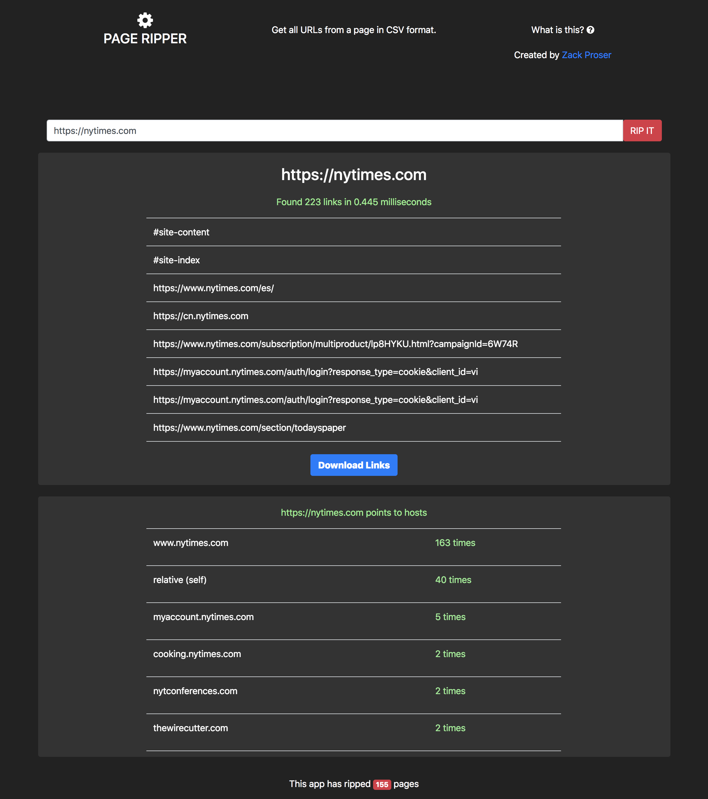
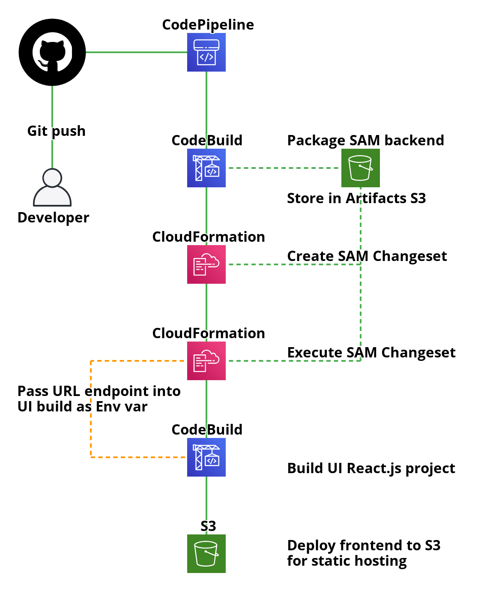

# Overview



This example repository contains a complete full-stack application deployed to AWS. See here for the deep-dive tutorial.

### Stack at a glance

* [AWS Serverless Application Model (SAM)](https://aws.amazon.com/serverless/sam/)
* [Golang](https://golang.org/)
* [DynamoDB](https://aws.amazon.com/dynamodb/)
* [React.js](https://reactjs.org/) frontend
* [S3 static site hosting](https://docs.aws.amazon.com/AmazonS3/latest/userguide/WebsiteHosting.html) for the frontend
* Git push deploys via [CodePipeline](https://aws.amazon.com/codepipeline/)
* Entire code pipeline codified in a [CloudFormation](https://aws.amazon.com/cloudformation/) template

It also demonstrates how to build a complete code pipeline that continuously deploys the frontend application and the Golang lambda stack everytime you git push to the main branch of your Github repository.

### Example application

The example application allows users to extract links from any website, does some light analysis on them, and allows users to download them all to a CSV file, while storing some job and metrics data in a DynamoDB table. Here's the overall flow of the application:



Here's what the UI looks like in action:



### Code pipeline flow



# Getting started

### 1. Setup your AWS credentials

[Follow this guide](https://docs.aws.amazon.com/cli/latest/userguide/cli-configure-profiles.html) to setup your AWS account profile in your `~/.aws/credentials` file.

### 2. Create a Github personal access token

[Follow this guide](https://docs.github.com/en/github/authenticating-to-github/creating-a-personal-access-token) to create a Github personal access token.

[This AWS guide](https://docs.aws.amazon.com/quickstart/latest/cicd-taskcat/step2.html) describes the token scopes you will need and the information to take note of.

Finally, export your Github personal access token to the shell you're going to use to deploy the CloudFormation code pipeline:

```
export GITHUB_OAUTH_TOKEN=<your-github-personal-access-token>
```

### 3. Deploy the Pageripper application stack to AWS manually

Note that, because the code pipeline currently relies on a cross-stack reference to the lambda backend's URL endpoint variable, you must first deploy this backend stack manually before creating the code pipeline, otherwise the pipeline Cloudformation deployment will fail and rollback automatically when the cross-stack reference cannot be resolved.

1. Build the stack `sam build`
2. Deploy the stack `sam deploy --guided --profile <your-aws-profile-name>`

### 4. Deploy the code pipeline

Change into the `codepipeline` directory of this repository and run this command:

```
aws cloudformation deploy \
--template-file code-pipeline.yaml \
--stack-name pageripper-code-pipeline \
--profile <your-aws-profile-name> \
--region us-west-2 \
--parameter-overrides GithubOAuthToken=$GITHUB_OAUTH_TOKEN \
--capabilities CAPABILITY_NAMED_IAM
```

This app leverages the git push deployment model, by creating a code pipeline leveraging CodeBuild and CodeDeploy for the frontend and backend.

The code pipeline builds the frontend React.js app and pushes its artifacts to an S3 bucket that serves the Single Page Application (SPA) as a static website.

The backend leverages the AWS Serverless Application Model (SAM). Changes to the backend code are therefore built and delivered via calls to Cloudformation itself.

# Developing the application locally


### 1. Install AWS SAM

Follow the [AWS SAM Getting Started guide](https://github.com/aws/serverless-application-model#get-started) on the Github repo.

### 2. Run the lambda + API Gateway backend locally

We pass the `--profile` flag so that the local instance of SAM has sufficient credentials to interact with remote AWS DynamoDB tables, etc.

```
sam local start-api --profile <your-aws-profile-name>
```

### 3. Run the UI locally

Export the environment variable that points the UI at the serverless endpoint:

`export REACT_APP_API_URL=<url output from most recent deployment>`

```
cd ui && npm run start
```

If there are issues resolving packages

```
# blow away the local node_modules folder and reinstall
rm -rf node_modules && npm i
```

